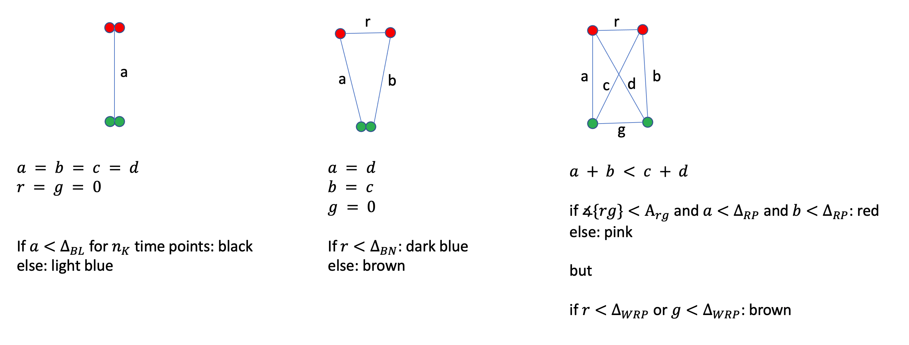

```{css css_options, echo=FALSE}
pre code, pre, code {
  white-space: pre !important;
  overflow-x: scroll_box() ! important; 
  word-break: keep-all !important;
  word-wrap: initial !important;
}
```

```{r options, echo=FALSE}
knitr::opts_chunk$set(
  warning = FALSE,
  message = FALSE,
  echo = FALSE,
  cache = TRUE,
  autodep = TRUE
)
options(
  width = 100,
  knitr.table.format = "html"
)
```

```{r libraries, cache=FALSE}
library(targets)
library(tidyverse)
library(kableExtra)

myKable <- function(df, row.names=FALSE, col.names=NA, digits=2, bootstrap="condensed", font.size=12, label=NULL, caption=NULL) {
  kable(df, format="html", row.names=row.names, col.names=col.names, digits=digits, label=label, caption=caption) %>%
    kable_styling(bootstrap_options=bootstrap, full_width=FALSE, position="left", font_size=font.size)
}

N <- function(x) prettyNum(x, big.mark = ",")
```

Collaborators: Tomo Tanaka, John Eykelenboom

[Proposal]()

Shiny data explorers

 - [state diagnostic](https://shiny.compbio.dundee.ac.uk/private/marek_chromcom2/states/)

#  {.tabset}

## Proposal

This is continuation of the previous [Chromatin Compaction Modelling](http://www.compbio.dundee.ac.uk/user/mgierlinski/chromcom/doc/mod3.html) project. John is working on new data, but this time we have full 3D co-ordinates of each dot from the tracking software (which one?). The first step is to convert these co-ordinates into cell states, denoted by a colour.

### Description by John

Raw data for cells is in form of Excel files. There are 3 files per cell

-   the whole track length [fr x - z] = frames x to z
-   up to NEBD [fr x - y]
-   after NEBD [fr y+1 -- z]

In the case of the first file type there is no assignment of NEBD so these cells will not be automatically aligned according to our previous work. Maybe the second two file types are better; the two halves can be stitched together and then different cells aligned with each other according to the join (let me know what you think if this will work well).

When I tracked the dots the objects are organised into "tracks" that always refer to either red or green (not mixed). The colour for a given track could be determined by looking at the intensities in ch.1 (red) or ch.2 (green) for the objects of the track (and compared to the intensities for the same channel in the other tracks). I could also assign the colours on the excel sheet if this would be easier (e.g. manually make a new tab with the info). [information for channel 3 and 4 are simply masked versions of 1 and 2 that I use for tracking more easily].

The rules and colour coding we worked with in our previous study (distances are approx.):

-   Light Blue = 2 dots (not overlapping e.g. \> 0.3 µm)
-   Dark blue = 3 dots (where dots of the same colour have distance \< 0.75 µm)
-   Brown = 3 dots (where dots of the same colour have distance \> 0.75 µm)
-   Pink = 4 dots (no restriction on distance)
-   Red = 4 dots (with 2 pairs of red/green overlapping e.g. \< 0.3 µm)

Later addition:

-   Black = 2 dots (overlapping e.g. \< 0.3 µm)

## Colour identification

Objects are organised into "tracks", that always refer to one colour, red or green. The software outputs intensities measured in two channels: red and green. Initially, I thought I could simply decide the colour of a dot based on which intensity is larger, red or green. However, some tracks have dots where green \> red or red \> green at different time points. See this example, made for cell_1. Tracks `1000000000` and `1000000101` have intensities on both sides of red=green line.

```{r colour_id, fig.width=6, fig.height=4}
tar_read(fig_colour_ident_cell_1)
```

For now, we use manual annotation, that is a track with given ID has a colour assigned manually by John.

### Intensity difference

Intensity in red and green channels can fluctuate and even a green dot can sometimes become a bit red. However, when we have two or more dots, it might be easier to assign colours by comparing them in each frame.

The figure below shows the intensity difference (green - red) for each dot at each time point for cell 1. The letters at the bottom indicate the state (L-light blue, B-dark blue, K-black, W-brown, P-pink, R-red). The digits show the number of points in the XYZ data. Bold font indicates missing points in intensity data.


```{r colour_diff_timeline, fig.width=10, fig.height=4}
tar_read(fig_colour_timeline_cell_1) 
```

Now we see that in most cases green dots have higher green-red difference than red dots, as expected. This holds true for frames around time -8 to -3 min, where red dots have positive green-red: green dots are always greener.

There are a few issues with this. They are marked with grey boxes. There are a few types of issues and I discuss them here, by looking at raw data.

#### -31 min

There is only one green dot in the figure. Here is some raw data from this frame.

```{r raw_m31}
r <- tar_read(raw_ex_cell1_m31)
myKable(r$Position, caption="Position")
myKable(r$`Intensity Median Ch=1 Img=1`, caption="Intensity Median Ch=1 Img=1")
myKable(r$`Intensity Median Ch=2 Img=1`, caption="Intensity Median Ch=2 Img=1")
```

There are two dots in the `Position` sheet, but only one in intensity sheets, for red and green channels. Intensity data for track `1000000143` is missing in both channels.

#### -13 min

Here we have two red dots in the plot.

```{r raw_m13}
r <- tar_read(raw_ex_cell1_m13)
myKable(r$Position, caption="Position")
myKable(r$`Intensity Median Ch=1 Img=1`, caption="Intensity Median Ch=1 Img=1")
myKable(r$`Intensity Median Ch=2 Img=1`, caption="Intensity Median Ch=2 Img=1")
```

Just like above, intensity data from track `1000000047` is missing. There are two dots with measured position, byt only one of them has measured intensities.

#### +6 min

This is an interesting case.

```{r raw_p6}
r <- tar_read(raw_ex_cell1_p6)
myKable(r$Position, caption="Position")
myKable(r$`Intensity Median Ch=1 Img=1`, caption="Intensity Median Ch=1 Img=1")
myKable(r$`Intensity Median Ch=2 Img=1`, caption="Intensity Median Ch=2 Img=1")
```

There are four dots in position and intensity, but intensities of dots in rows 2 and 3 are identical, in each channel. It looks like maybe a dot intensity was missing, but it was replaced with an intensity from another dot. As a result, we have a red dot with green intensity way too large than it should be.

## State identification

I follow rules as outline in the proposal. They are fairly straightforward, except for the case of four dots.

From John:

*In the cell each green dot is linked directly to one red dot (they are on the same sister chromosome) and likewise the same green dot is not linked to one red dot. Unfortunately we cannot say unambiguously which green should match with which red as we have no way to distinguish (or our analysis so far has not been so sophisticated). In our JCB paper (you can look at Figure S1C-F) I did some measurements in a small batch of data. As you can see when I was plotting distances between red and green dots (part E) I obtained all four possible distances and put them into the two possible combinations (a & b or c & d). For the analysis and plotting I just took the shortest combined pairs of distances between red and green dots -- in the cartoon this is a and b (and discard distances c and d). For red pattern to be true, then a and b should both be less than 0.3-0.4µm (otherwise the pattern is deemed pink).*

I follow this approach. I calculate distances for the two possible combination of red and green dots, and then select the combination with smaller mean distance. The state is deemed red when both distances in this combination are less than the limit.

This cartoon figure defines distances a, b, r and g.

```{r fig_rules}

```

### Tracking cells

This figure demonstrates how state tracking works. The shapes indicate number of dots detected, the colour indicates the state. The horizontal dashed lines show the distance limits applied.

```{r fig_example_tracks, fig.width=10, fig.height=25}
tar_read(fig_cells_state_distance)
```

This is a more traditional look at the data:

```{r fig_cells_map, fig.width=10, fig.height=6}
tar_read(fig_cells_map)
```

What might be of interest, is the distribution of distances between dots. The next figure shows the aggregated distribution across all cells, for two, three and four dots detected. In case of four dots both distances are plotted, hence there are twice as many data points than images. Also, there are pink states below the limit (0.4 µm) - these are the cases where only one distance is below the limit.

```{r fig_distance_distribution, fig.width=10, fig.height=4}
tar_read(fig_cells_distance_distribution)
```

Another plot showing all distances (a, b, r and g):

```{r fig_all_distances, fig.width=10, fig.height=25}
tar_read(fig_all_distances)
```

## Red-red/green-green angle

Angle distribution between red-red and green-green vectors - only for cases with four dots.

```{r angle_dist, fig.width=8, fig.height=4}
tar_read(fig_angle_distribution)
```

Here is a timeline of angles, divided into windows of 10 min.

```{r angle_time, fig.width=10, fig.height=4}
tar_read(fig_angle_timeline)
```

The next figure shows the relation between maximum of the distances a and b, and the angle.

```{r angle_distance, fig.width=8, fig.height=6}
tar_read(fig_distance_angle) 
```

The same figure, but split into time windows.

```{r angle_distance_timeline, fig.width=10, fig.height=3}
tar_read(fig_distance_angle_timeline) 
```

What if the large red-green angles at small a/b distances are a result of increased error when r/g distances are also small? This figure shows the red-green angle as a function of the smallest of the r, g distances. It only contains data below the red-pink limit (the vertical dashed line in figures above).

```{r rg_angle, fig.width=6, fig.height=4}
tar_read(fig_rg_angle) 
```

Perhaps, with brown-pink limit set to 0.5, all these high angles can be attributed to brown.


## Session info

```{r session_info}
sessionInfo()
```
